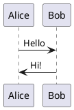

## Заголовок 2 уровня

@startuml
Bob -> Alice : hello
@enduml


Ненумерованный список

- List
- List
- List

Нумерованный список

1. List
2. List
3. List

`Inline code`

```
<h1>Sample heading</h1>
```

*Italic text 1*

**Bold text 1**

 > Blockquote text.

[Link](https://example.com/)

```javascript
function doSomething() {
	// Write code here
}
```

- [ ] incomplete task
- [x] completed task

# Examples

Set `plantuml:{filename}` as a fence information. `filename` is used as the file name of generated diagrams. In the following case, `md-sample-sequence.svg` is created.
`filename` is required.




